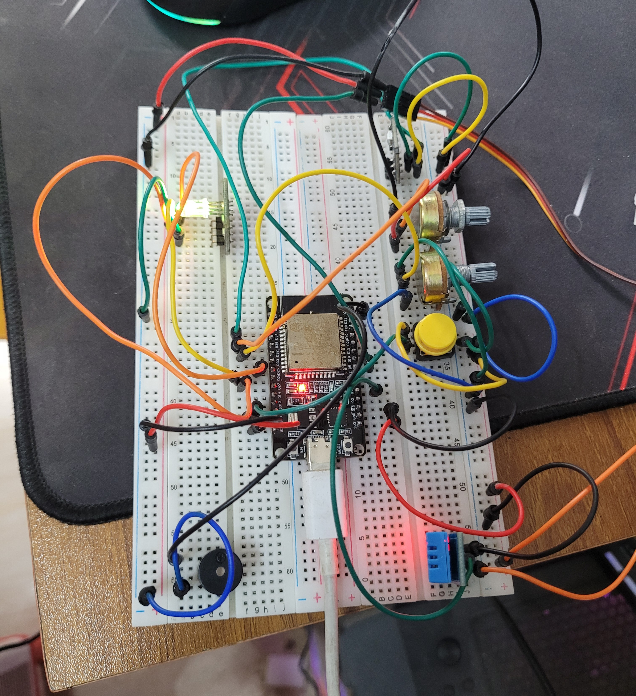
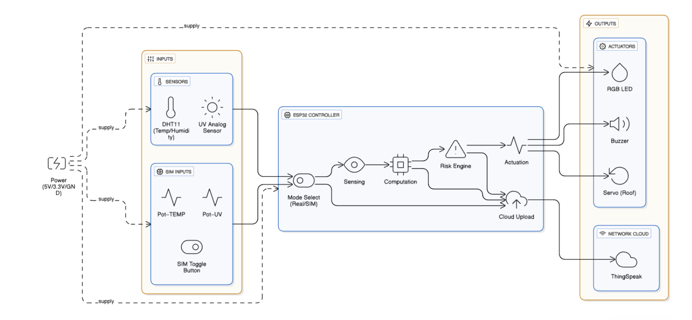
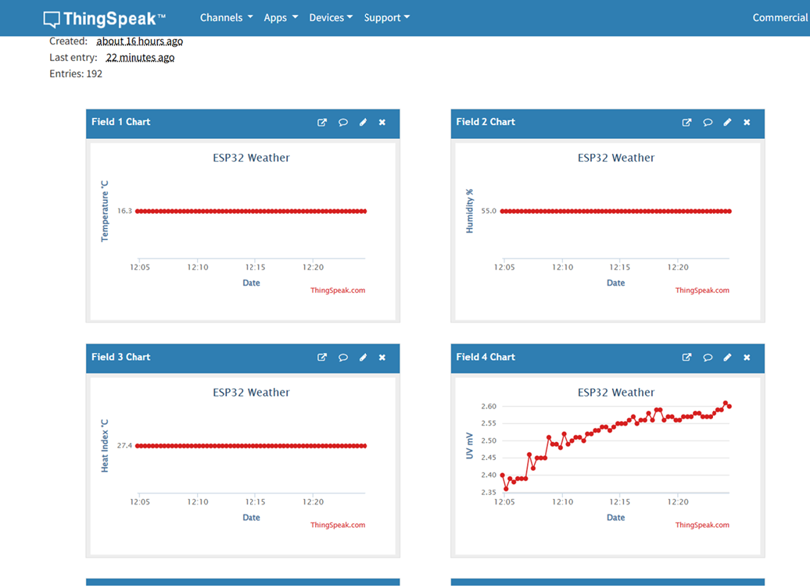

# Intelligent Weather & UV Sensing System with Auto-Alert, Roof Control & ThingSpeak Analytics

## Project Overview
This project presents an innovative and low-cost ESP32-based system designed to measure ambient temperature, humidity, and ultraviolet (UV) intensity. It computes a heat-index-aware risk level and provides real-time local responses, such as activating a buzzer, RGB LED indicator, and a servo-controlled roof. Data is also uploaded to ThingSpeak for cloud-based analytics and visualization. The system features both real sensor and simulation modes, enabling versatile demonstration capabilities.

  

## Key Features:
- **Real-Time Measurements**: Temperature, Humidity, and UV Index (UVI) sensing.
- **Risk Assessment**: Heat Index (HI) and UVI are combined to assess environmental risk.
- **Local Actuation**: Servo motor adjusts roof position, RGB LED provides visual feedback, and buzzer alerts users based on risk thresholds.
- **Cloud Analytics**: Data uploaded to ThingSpeak for visualization and historical analysis.
- **Sim Mode**: Allows for testing and demonstrations with potentiometers as substitutes for sensors.

## System Components:
- **ESP32 DevKit V1** (Microcontroller)
- **DHT11** (Temperature & Humidity Sensor)
- **UV Analog Sensor** (For UV Index)
- **RGB LED**, **Buzzer**, **Micro Servo**
- **Potentiometers** (for simulation mode)
- **ThingSpeak** (for cloud data logging and visualization)

## Architecture:
The system uses multiple sensors and actuators, all managed by the ESP32. The core components communicate through GPIO pins for analog readings and digital actuation, while the microcontroller communicates with ThingSpeak via Wi-Fi for cloud updates.

  
*Architecture Diagram (Page 3 of Report)*

## How it Works:
1. **Sensing**: Temperature, Humidity, and UV levels are continuously monitored.
2. **Computation**: A heat index and UV index are calculated, and a risk level is derived.
3. **Actuation**: Depending on the risk level, the system activates:
   - **RGB LED**: Normal (Green), Caution (Amber), Warning (Red), Danger (Magenta).
   - **Buzzer**: Beeps when temperature crosses a threshold.
   - **Servo**: Roof is adjusted to protect from UV exposure.
4. **Cloud Upload**: Data is sent to ThingSpeak for continuous monitoring and visualization.
   

## How to Use:
1. **Download** the project files from the repository.
2. **Connect** the ESP32 to your Wi-Fi network.
3. **Upload** the firmware to the ESP32 using the Arduino IDE.
4. **Access** the ThingSpeak dashboard to monitor the data in real-time.

